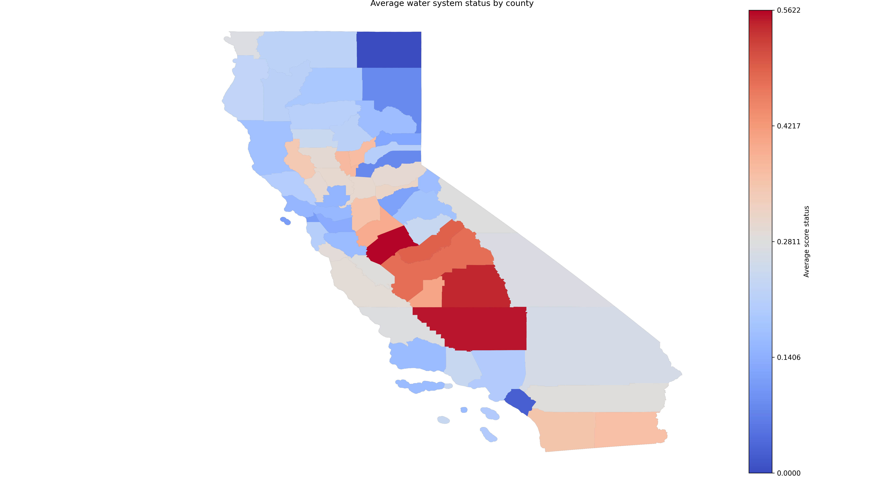
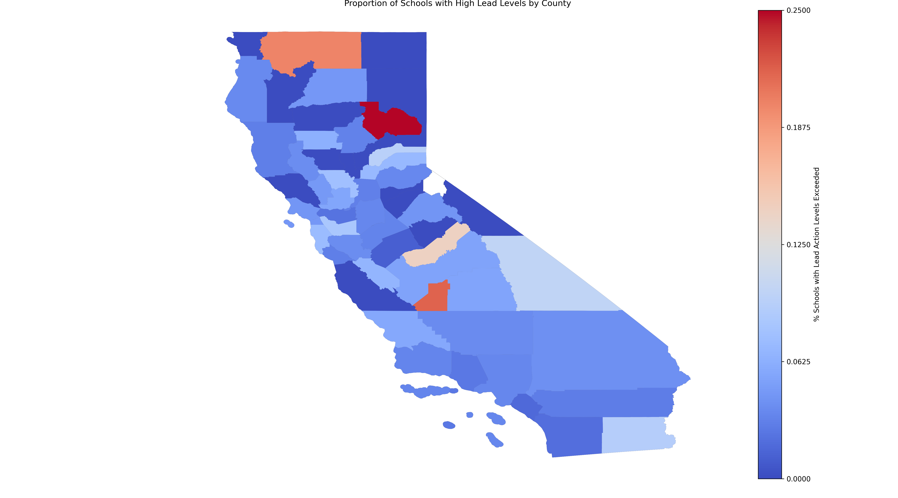

# Clean Water Accessibility in California

## Background
Access to clean drinking water is essential to ensuring public health and preventing the spread of infectious diseases like cholera and typhoid. The Centers for Disease Control and Prevention (CDC) found that 477,000 people became sick and 6,900 died from waterborne infectious diseases in the US from 2003 to 2009. In addition to water-borne illnesses, water contaminated with lead, arsenic, nitrate, and 1-2-3 TCP can cause severe health consequences like skin cancer and problems with the cardiovascular, gastrointestinal, and neurological systems. 

Despite the huge progress made in improving the safety of water in recent decades, many water systems and schools in California today fail to meet safety criteria upheld by the State Water Board's Human Right to Water Resolution that recognizes the human right to safe, clean, affordable, and accessible water. 

Sources of contaminated water include industry and agriculture, human and animal waste, treatment and distribution, and natural sources. 
Access to clean water is a matter of justice. In a social epidemiological study conducted in 2005-2010, scientists found an association between socioeconomic and environmental factors that place socially disadvantaged communities at greater risk of exposure to contaminated drinking water. More research is needed to identify the disparities that people of low socioeconomic status face in accessing water.

This analysis examines the geospatial associations between poverty and unsafe drinking water systems/water safety violations in current-day California.

## Research Question

What is the association between poverty and access to clean water in California?

## Data

The datasets explored include the poverty levels, lead levels, and water risk assessment scores. The percentages of people below poverty per county from 2017 to 2021 were derived from the National Institute on Minority Health and Health Disparities provided by the Census and American Community Survey. The threshold for poverty as defined by the federal government changes yearly and is adjusted for inflation. Lead level data from 2017-2019 was collected by the Division of Drinking Water in collaboration with the California Department of Education. Schools and community water systems were assessed for lead, and those exceeding the threshold were noted as action level exceedance (ALE). The water risk assessment data from 2023-2024 were sourced from the State Water Board. Assessment scores for each water system were a weighted sum of water quality risk, water shortage risk, and socioeconomic risk. 

## Methodology

First, data on California county boundaries, poverty levels, lead levels, and water risk assessment scores were gathered. Then, data cleaning and merging were performed at the county level. Then, aggregate measures were calculated, including the proportion of schools with ALE per county, the average water risk assessment score per county, and the proportion of high-risk water systems per county. The proportion of schools of level ALE per county was calculated by assigning a score of one to each school with at least one sample ALE and counting the number of schools per county. The average water risk assessment score was calculated from a string variable with values “Failing,” “At-Risk”, “Potentially At-Risk”, and “Not At-Risk”. Each water system was assigned a numerical equivalence of 1, 0.66, 0.33, and 0, respectively. Then, the sum of each risk assessment score was divided by the total number of water systems in that county to determine the average. To evaluate the proportion of high-risk water systems per county, the total number of “Failing” water systems was divided by the total number of water systems.

Geospatial mapping of descriptive statistics per county was conducted including poverty rate, proportion of schools with lead action level exceedance, average water risk assessment score, and proportion of failing water systems.

To determine bivariate relationships, linear regression, and bivariate mapping were performed for each of the variables stated above by poverty rate. The R-squared and p-value for each regression were noted to interpret the strength of associations. 

All data cleaning, analyses, and visualizations were conducted using Python.

## Results

### Descriptive

The highest poverty rates are seen in two main clusters: most northern counties, Central Valley, and one in the southern part of the state.

The highest poverty rates are summarized here:
<table>
  
When evaluating water system status, most are not at risk, but a substantial amount of water systems serving 722,750 people are failing. 

The highest average water risk assessment scores were clustered mostly in the Central Valley.

The counties with the highest scores are seen in the table:
<table>

The counties with the highest proportion of failing water systems are also clustered in the Central Valley.

<table>

Counties with the highest proportion of schools with ALE are in northern and central counties. 

<table>

  
### Bivariate

The linear regression of poverty rate as the predictor and average water assessment score as the outcome revealed an R^2 of 0.18 and a p-value of 0.001.

The linear regression of poverty rate as a predictor and proportion of failing water systems as the outcome resulted in an R^2 of 0.14 and a p-value of 0.004.

The linear regression of poverty rates by the proportion of schools with ALE found an R^2 of 0.004 and a p-value of 0.649.

## Conclusion

Water disparities and high poverty rates are prevalent in the Central Valley, which is known for its rural farm environment. There is a positive correlation between poverty and access to clean water, though the strength is fairly weak. There may be confounders including regulatory enforcement, geographical factors influencing water quality, and political factors resulting in a biased estimate. 

Given that there is a large cluster of high-risk water systems in the Central Valley, more interventions and policies must be implemented to address these disparities. Upgraded infrastructure, strict enforcement, and poverty reduction are needed to alleviate the community’s burden. There must be more collaboration between community officials, the California Department of Public Health, and the State Water Board to ensure that individuals from all counties can exercise their right to access clean water. 

## Limitations

There was missing data from 3230 water systems that serve 39.54 million people. More data as stated in the conclusion are needed to improve models. 
